<p align="center">
  <a href="https://github.com/wtg-codes/agy-box/actions/workflows/ci.yml">
    
  </a>
  <a href="https://github.com/wtg-codes/agy-box/releases">
    
  </a>
  
  <a href="LICENSE">
    
  </a>
</p>

# 📦 Antigravity Dev Box (agy-box)

agy-box is agy and friends in a box of your choice! This repository builds the `agy-box`, which is the Distrobox workspace container for the `bluefin-wtg` ecosystem. It contains scripts to scaffold the necessary tools and dependencies for an AI agent developer environment.

---

## Navigation & Guides

- 🏛️ **[System Architecture Guide](file:///var/home/wtg/Repos/agy-box/docs/architecture.md)** — Detailed walkthrough of the host-to-container bridging, D-Bus session keyring pipelines, and interactive setup assistant sequence flows.
- 🤝 **[Developer Contribution Guide](file:///var/home/wtg/Repos/agy-box/CONTRIBUTING.md)** — Learn how to set up your environment, build from source, and run verification lints.
- 🛠️ **[Setup & Troubleshooting Guide](file:///var/home/wtg/Repos/agy-box/docs/SETUP.md)** — Comprehensive guidelines on prerequisites, rootless configurations, toolchain exporting, and detailed troubleshooting solutions.

---

## Table of Contents

- [Quick Start (No Clone Required)](#quick-start-no-clone-required)
- [Prerequisites](#prerequisites)
- [Architecture](#architecture)
  - [Host-Integrated Sandbox Model](#host-integrated-sandbox-model)
  - [Layered Architecture](#layered-architecture)
  - [Product Deep Dive: The Antigravity Suite](#product-deep-dive-the-antigravity-suite)
- [First-Time Setup Assistant](#first-time-setup-assistant)
- [Setup and Management](#setup-and-management)
- [Testing](#testing)
- [Troubleshooting](#troubleshooting)
- [CI/CD Pipeline](#cicd-pipeline)

## Quick Start (No Clone Required)

You can launch the interactive workspace manager and install the environment directly from your terminal without even cloning this repository:

```bash
bash -c "$(curl -fsSL https://raw.githubusercontent.com/wtg-codes/agy-box/main/agy-box-manager)"
```

*(From the interactive menu, simply select **"Install CLI Globally"** to save the tool to your system permanently!)*

## Prerequisites

If you plan to use this container locally or build from source, your host system requires the following dependencies:
- **A Container Runtime**: Either **Podman** (recommended) or **Docker**.
- **Distrobox**: To seamlessly integrate the container into your host OS environment.
- **Gum**: A highly glamorous tool for shell scripts (used for our interactive CLI).

*(Note for **Universal Blue (Bluefin/Bazzite/Aurora)** and other immutable OS users: Podman, Distrobox, and Homebrew are usually pre-configured. If `gum` is missing, the manager script will automatically offer to install it using your system's package manager!)*

## Architecture

The `agy-box` is designed to run via **Distrobox** on the `bluefin-wtg` immutable host OS (or any standard Linux distribution). It leverages an Ubuntu toolbox base image (`ghcr.io/ublue-os/ubuntu-toolbox:latest`) and acts as a host-integrated developer sandbox.

### Host-Integrated Sandbox Model

Unlike traditional isolated virtual machines or containers, Distrobox provides a highly integrated environment that bridges the gap between isolation and usability. Key host integrations include:

*   **Home Directory Mounting:** The user's host home directory (`~/`) is mounted directly inside the container. This shares all code workspace directories (such as `~/my-antigravity-work`), host Git configurations, and standard shell settings seamlessly.
*   **Graphical Application Forwarding (GUI):** By mounting the host's X11 or Wayland sockets (`/tmp/.X11-unix` or `$WAYLAND_DISPLAY`) and sharing access to GPU devices (`/dev/dri`), graphical tools like **Google Antigravity (Agent UI)** and **Google Chrome** render natively on the host's desktop environment without a VNC server or separate window manager.
*   **Inter-Process Communication (IPC):** Sockets and networking are shared, allowing local host applications (like VS Code or browser tabs) to communicate with containerized agent servers over `localhost` ports.
*   **Audio & Devices:** Audio devices (PulseAudio/PipeWire) are forwarded to support sound notifications, and USB devices (e.g. for Android development via the ADK) can be shared directly with the sandbox.

---

### Layered Architecture

The diagram below outlines the layering stack and the host integration bridge of the `agy-box` sandbox developer environment:



---

### Product Deep Dive: The Antigravity Suite

The developer environment packages four distinct products of the Google Antigravity ecosystem, each serving a specific role in agentic development:



#### 1. Google Antigravity (Agent UI) / Antigravity "2.0"
*   **Role & Description:** The agent-first UI (canvas, terminal, course labs) featuring the Gemini-powered software engineering assistant.
*   **Install & Build Mechanics:**
    *   **Source Script:** Built using `scripts/install-antigravity.sh` during the container image build.
    *   **Package Origin:** Linux x64 tarball fetched from the Google Cloud Storage bucket:
        `https://storage.googleapis.com/antigravity-public/antigravity-hub/2.0.1-6566078776737792/linux-x64/Antigravity.tar.gz`
    *   **Integrity Check:** Validated via SHA-256 hash `0727e1f56961b6d2347941f278da69cc6c17de3befe988524848cd167380e9ab`.
    *   **Installation Directory:** Extracted directly to `/usr/share/antigravity`.
    *   **Execution Wrapper:** Accessible globally via `/usr/bin/antigravity`. The wrapper script launches the Agent UI with `--disable-dev-shm-usage` to prevent crashes when running under standard container runtimes.
    *   **Default Configuration:** Pre-configured telemetry settings mapped into `/etc/skel/.config/Antigravity/User/settings.json` which disables telemetry (`"antigravity.account.enableTelemetry": false`) by default for all new shell users.
*   **Usage Workflows:**
    *   **Launch:** Run `antigravity` inside the container terminal.
    *   **Browser Control:** Uses Chrome Developer Protocol (CDP) to drive the container-installed `google-chrome-stable` to execute agentic browser interactions.
    *   **Settings Path:** Workspace configuration and accounts are persisted in `~/.config/Antigravity-box`.

#### 2. Antigravity IDE (VS Code-based Classic IDE)
*   **Role & Description:** The classic VS Code-based developer IDE.
*   **Install & Build Mechanics:**
    *   **Source Script:** Built using `scripts/install-antigravity-ide.sh` during the container image build.
    *   **Package Origin:** Linux x64 tarball fetched from Google Cloud Storage:
        `https://edgedl.me.gvt1.com/edgedl/release2/j0qc3/antigravity/stable/1.23.2-4781536860569600/linux-x64/Antigravity.tar.gz`
    *   **Integrity Check:** Validated via SHA-256 hash `5232a4048ff4fa15685d9a981ba4fba573e297f3efc9b76f638e794baf775725`.
    *   **Installation Directory:** Extracted directly to `/usr/share/antigravity-ide`.
    *   **Execution Wrapper:** Accessible globally via `/usr/bin/antigravity-ide`. The wrapper script launches the classic IDE with `--disable-dev-shm-usage` to prevent shared memory crashes.
    *   **Default Configuration:** Pre-configured telemetry settings mapped into `/etc/skel/.config/Antigravity-ide/User/settings.json` which disables telemetry by default.
*   **Usage Workflows:**
    *   **Launch:** Run `antigravity-ide` inside the container terminal.
    *   **Settings Path:** Workspace configuration and accounts are persisted in `~/.config/Antigravity-ide-box`.

#### 3. Antigravity CLI (`agy`)
*   **Role & Description:** A native command-line utility used to interface with the Antigravity developer environment, run course labs, submit tasks, and verify local agent status.
*   **Install & Build Mechanics:**
    *   **Source Script:** Configured via `scripts/install-antigravity-cli.sh`.
    *   **Package Origin:** Precompiled Linux x64 executable tarball:
        `https://storage.googleapis.com/antigravity-public/antigravity-cli/1.0.0-5288553236791296/linux-x64/cli_linux_x64.tar.gz`
    *   **Integrity Check:** Validated using SHA-512 hash `5ccdcc01fb863c7e8e56473c6c95dba75fed4fd2a242200d80cfc4c7fab811b733f5a7fab25332130aad298e72627e1018e6911a5658f4f059ef6e019f211972`.
    *   **Target Path:** Placed directly at `/usr/bin/agy` for global execution.
*   **Usage Workflows:**
    *   **Launch:** Executed via `agy` (e.g. `agy --version` or `agy --help`).
    *   **Lab Submission:** Interacts with GitHub APIs using Git config files and GitHub Personal Access Tokens stored in `~/.config/environment.d/antigravity-mcp.conf`.
    *   **IDE Communication:** Uses local WebSocket loops to negotiate commands and check states with a running Antigravity Agent UI instance on the host/container bridge.

#### 4. Antigravity SDK (`google-antigravity`)
*   **Role & Description:** Programmatic Python SDK allowing developers to control Antigravity agents, run custom code analysis modules, and write custom extension scripts.
*   **Install & Build Mechanics:**
    *   **Source Script:** Configured via `scripts/install-antigravity-sdk.sh`.
    *   **Package Origin:** Standard Python Package Index (PyPI).
    *   **Install Command:** `pip3 install --no-cache-dir --break-system-packages google-antigravity==0.1.0`.
    *   **Target Path:** Installed container-wide in python's system site-packages (e.g. `/usr/local/lib/python3.*/dist-packages/google_antigravity`).
*   **Usage Workflows:**
    *   **Import:** Used in Python files by running `import google.antigravity`.
    *   **API Control:** Commands are sent programmatically from the script to the local Agent UI backend server running on port `8080` (or dynamically mapped ports).
    *   **Cloud Authentication:** Can interface with Google Cloud Platform services (such as Gemini/Vertex AI) using Application Default Credentials (ADC) configured in the active environment.

---

## First-Time Setup Assistant

When you enter the `agy-box` container for the first time, a setup helper script (`agy-setup-helper`) launches automatically to guide you through environment initialization and sanity checks:

1. **Host Keyring Verification**: Asserts that D-Bus socket forwarding is configured correctly and `libsecret` is available inside the container to communicate with the host's GNOME Keyring.
2. **Antigravity API Keys**: Prompts you to input your Gemini or Antigravity API keys if they are not already set in the environment, and securely writes them to `~/.config/environment.d/agy-box.conf` so they are automatically loaded in all subsequent container and IDE sessions.
3. **Browser Execution Health**: Verifies that Google Chrome is correctly wrapped and can be executed inside the container without sandboxing collisions.
4. **Git Identity**: Validates that your git username and email are set so you can immediately commit code.
5. **Security & Skills Pack Audits (Optional)**: Runs an interactive check to:
   - Verify privilege boundaries (ensure non-root container execution).
   - Scan for wildcard listener port exposure (scanning `/proc/net/tcp` to ensure dev servers aren't exposed).
   - Harden permissions of sensitive config files (`~/.config/environment.d/agy-box.conf`, `~/.ssh/`, GCP ADC credentials) to `600`/`700` automatically.
   - Verify Developer Skills Pack requirements (Android USB `/dev/bus/usb` mounts, `gcloud` configs, VDI desktop packages).

*(Note: The setup helper creates a flag file `~/.config/agy-box/.setup_done` upon completion. You can re-run it manually at any time using the `agy-setup-helper` command).*

---

## VDI Web Desktop (Headless VDI)

For developers on remote VM instances, headless cloudtops, or those who prefer running the container's graphical user interface (Antigravity IDE & Google Chrome) in a standalone window, we provide a pre-packaged **noVNC HTML5 VDI virtual desktop**.

To start the desktop session, run:
```bash
# Using agy-box-manager:
agy-box-manager desktop

# Or using just:
just agy-desktop
```
This will automatically launch `Xvfb` (Virtual Framebuffer), `openbox` (window manager), `x11vnc` (VNC server), and `websockify` (noVNC gateway) inside the container. 

Simply open **`http://localhost:6080/vnc.html?autoconnect=true`** in your host browser to access the complete container desktop!

---

## Setup and Management

We provide a beautiful, context-aware interactive CLI tool to easily install, build, and manage your agent workspaces across all Linux distributions.

If you cloned the repo or installed the tool globally, run:

```bash
agy-box-manager
```

*(Alternatively, if you are in the cloned repository and have `just` installed, you can simply type `just agy` in your terminal to launch the menu!)*

This will launch an interactive menu that detects the current state of your system, displays a status panel of your installed tools/workspaces, and offers to:

1. Pull and install the official stable release from GHCR (or update it if it exists).
2. Build a local development workspace from the source files.
3. Enter your active workspaces.
4. Check the status or securely remove old environments.
5. **Install the CLI globally** so you can run `agy-box-manager` from anywhere on your system.
6. **Uninstall the CLI** entirely if you no longer need the global binary or its auto-completions.

### Scriptable Usage

You can also bypass the interactive menu by passing commands directly, which is useful for automation or quick terminal actions. We provide native support for `just` commands alongside standard bash execution (namespaced with `agy-` to prevent collisions on Universal Blue systems):

| Action | Bash Command | Just Command |
| :--- | :--- | :--- |
| **Interactive Menu** | `agy-box-manager` | `just agy` |
| **Install Official** | `agy-box-manager install` | `just agy-install` |
| **Build Dev Env** | `agy-box-manager dev` | `just agy-box-dev` |
| **Enter Official Env** | `agy-box-manager enter` | `just agy-enter` |
| **Enter Dev Env** | `agy-box-manager enter dev` | `just agy-enter-dev` |
| **VDI Desktop (Official)** | `agy-box-manager desktop` | `just agy-desktop` |
| **VDI Desktop (Dev)** | `agy-box-manager desktop dev` | `just agy-desktop-dev` |
| **Clean Official Env** | `agy-box-manager clean` | `just agy-clean` |
| **Global Install** | `agy-box-manager install-global` | `just agy-install-global` |
| **Global Uninstall** | `agy-box-manager uninstall-global` | `just agy-uninstall-global` |
| **Run Integration Tests** | `agy-box-manager test` | `just agy-test` |


## Alternative & Cloud Deployments

While `agy-box` is optimized for local execution via Distrobox, it is built as a standard, OCI-compliant container image (`ghcr.io/wtg-codes/agy-box-image:latest`). This enables deployment across various cloud and remote environments:

### 1. Cloud Virtual Machines (GCP Compute Engine, AWS EC2, Azure VMs)
You can run `agy-box` as a standalone daemon on any cloud instance running Docker or Podman.
*   **Run command:**
    ```bash
    docker run -d \
      --name agy-sandbox \
      -p 8080:8080 \
      -p 2222:22 \
      --security-opt label=disable \
      ghcr.io/wtg-codes/agy-box-image:latest
    ```
*   **Access Paths:**
    *   **noVNC HTML5 VDI Desktop:** Access a full graphical virtual desktop directly via `http://<vm-ip>:8080/vnc.html` (authenticated with your workspace password).
    *   **SSH Tunneling:** SSH directly into the sandbox via `ssh -p 2222 developer@<vm-ip>`.

### 2. Cloud IDE Platforms (GitHub Codespaces, Coder, Gitpod)
The `agy-box` image can serve as a base for cloud workspaces. 
*   **GitHub Codespaces (`.devcontainer/devcontainer.json`):**
    ```json
    {
      "name": "Antigravity Cloud Sandbox",
      "image": "ghcr.io/wtg-codes/agy-box-image:latest",
      "forwardPorts": [8080, 9222],
      "customizations": {
        "codespaces": {
          "openFiles": ["README.md"]
        }
      }
    }
    ```
    This launches a cloud workspace containing the entire Antigravity toolchain, fully integrated with your browser-based VS Code interface.

### 3. Jules VM Sandbox Execution (Agent Parity)
The cloud agent runtime execution system (Jules) pulls the `agy-box-image` directly to execute code, run validations, and perform refactoring. By using the exact same OCI image in the cloud VM as you do locally, you guarantee 100% environment parity, ensuring "works on my machine" translates perfectly to "works on the cloud agent."

### 4. Kubernetes (Stateful Dev Pods)
For enterprise multi-agent pipelines, `agy-box` can be scheduled on a Kubernetes cluster as a stateful container pod to act as a remote workspace node.

---

## Testing

We provide a local integration testing loop to verify that the built dev image and its installed dependencies are functioning correctly.

Run the test suite via the `just` recipe:

```bash
just agy-test
```

This will automatically:
1. Build the local dev image `localhost/agy-box:dev`.
2. Spin up a temporary distrobox container named `agy-box-test`.
3. Assert that all dependencies (`kubectl`, `helm`, `k9s`, `Gemini CLI`, `Google ADK`, `google-chrome-stable`, `Google Antigravity (Agent UI)`, `Antigravity IDE`, `Antigravity CLI (agy)`, and `Antigravity SDK`) exist in the container and can be executed.
4. Clean up and remove the temporary distrobox container `agy-box-test` regardless of success or failure.

## Troubleshooting

For detailed installation prerequisites, rootless engine configurations (Podman vs Docker), permission lockout fixes, and a comprehensive FAQ guide, please refer to the dedicated **[Setup & Troubleshooting Guide](file:///var/home/wtg/Repos/agy-box/docs/SETUP.md)**.

## CI/CD Pipeline

The container is automatically built and pushed to the GitHub Container Registry (GHCR) via GitHub Actions whenever changes are pushed to the `main` branch.

Key features of the pipeline include:
- **Fast Builds**: Leveraging Docker Buildx and GitHub Actions caching to ensure rapid builds.
- **Automated Metadata Extraction**: Using `docker/metadata-action` to automatically tag images and apply standard OCI annotations.
- **Build Provenance**: Automatically applying SLSA-compliant build provenance attestations (`actions/attest-build-provenance`) to verify the integrity and origin of the published container image.

## Artifacts

As part of the secure software supply chain, every image build produces a **Software Bill of Materials (SBOM)** in the standard SPDX JSON format using `anchore/sbom-action`. This artifact is uploaded and retained in the GitHub Actions build run for transparency and security auditing.

## Releases

The CI/CD pipeline is configured to automatically create a GitHub Release whenever a new version tag is pushed to the repository.

To trigger a formal release, follow these steps from your terminal:

1. **Create a tag** with a `v` prefix (e.g., `v0.5.0`):
   ```
   git tag v0.5.0
   ```
2. **Send the tag to the remote repository**:
   You will need to manually sync your tags with the remote repository on github. This usually looks like syncing the origin with the exact version tag you just created.

**What happens next?**
1. GitHub Actions detects the new tag and starts the workflow.
2. It builds and publishes the versioned container image (`agy-box:0.5.0`) to GHCR.
3. Once built, a new GitHub Release is automatically created with autogenerated release notes.
4. The generated SBOM (`sbom.spdx.json`) is securely attached directly to the GitHub Release.
