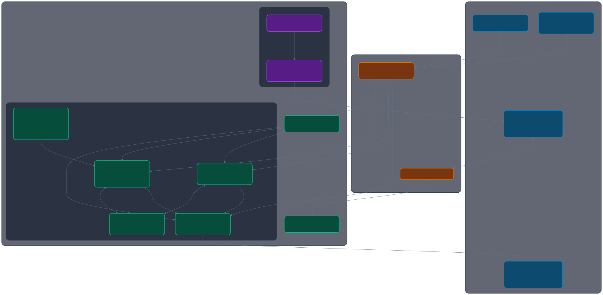
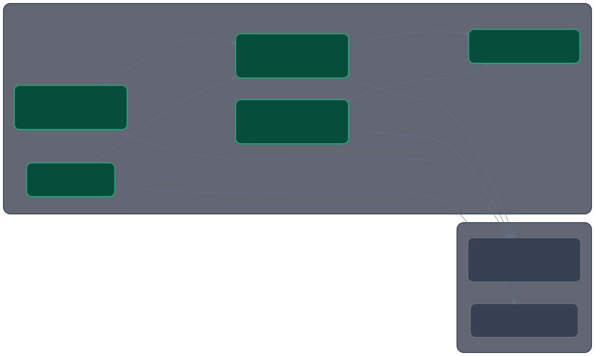

<p align="center">
  <a href="https://github.com/wtg-codes/agy-box/actions/workflows/ci.yml">
    
  </a>
  <a href="https://github.com/wtg-codes/agy-box/releases">
    
  </a>
  <a href="https://wtg-codes.github.io/agy-box/">
    
  </a>
  
  
  <a href="LICENSE">
    
  </a>
</p>

# 📦 Antigravity Dev Box (agy-box)

agy-box is agy and friends in a box of your choice! This repository builds the `agy-box`, which is the Distrobox workspace container for the `bluefin-wtg` ecosystem. It contains scripts to scaffold the necessary tools and dependencies for an AI agent developer environment.

> 🌐 **Project website: [wtg-codes.github.io/agy-box](https://wtg-codes.github.io/agy-box/)** — an interactive overview with the quick-start command, feature tour, architecture diagrams, and command reference.

The published container image is **`ghcr.io/wtg-codes/agy-box`** (`:latest` tracks `main`; releases are tagged `:<major>.<minor>.<patch>` and `:<major>.<minor>`, e.g. `:0.6.0` and `:0.6`).

---

## Navigation & Guides

- 📘 **[Master User Guide](docs/USER_GUIDE.md)** — Step-by-step handbook covering zero-to-hero setup, all 4 ways to work, IDE integrations (VS Code, Zed, Antigravity, JetBrains), AI model configuration, and CLI mastery.
- 🌐 **[Project Website](https://wtg-codes.github.io/agy-box/)** — Interactive landing page (GitHub Pages, built from [`docs/index.html`](docs/index.html)).
- 🏛️ **[System Architecture Guide](docs/architecture/system-architecture.md)** — Detailed walkthrough of the host-to-container bridging, D-Bus session keyring pipelines, interactive setup assistant sequence flows, and the CI/CD pipeline.
- 🤝 **[Developer Contribution Guide](CONTRIBUTING.md)** — Learn how to set up your environment, build from source, and run verification lints.
- 🛠️ **[Setup & Troubleshooting Guide](docs/SETUP.md)** — Comprehensive guidelines on prerequisites, rootless configurations, toolchain exporting, and detailed troubleshooting solutions.
- 🗺️ **[Roadmap / TODO](TODO.md)** — Planned improvements and possible future work.

---

## Table of Contents

- [Quick Start (No Clone Required)](#quick-start-no-clone-required)
- [Prerequisites](#prerequisites)
- [Known Limitations](#known-limitations)
- [Architecture](#architecture)
  - [Host-Integrated Sandbox Model](#host-integrated-sandbox-model)
  - [Layered Architecture](#layered-architecture)
  - [Product Deep Dive: The Antigravity Suite](#product-deep-dive-the-antigravity-suite)
- [First-Time Setup Assistant](#first-time-setup-assistant)
- [VDI Web Desktop (Headless VDI)](#vdi-web-desktop-headless-vdi)
- [Local Workspace Web Dashboard (Open WebUI)](#local-workspace-web-dashboard-open-webui)
- [Setup and Management](#setup-and-management)
- [Alternative & Cloud Deployments](#alternative--cloud-deployments)
- [Testing](#testing)
- [Troubleshooting](#troubleshooting)
- [CI/CD Pipeline](#cicd-pipeline)
- [Artifacts](#artifacts)
- [Releases](#releases)

## Quick Start (No Clone Required)

You can launch the interactive workspace manager and install the environment directly from your terminal without even cloning this repository:

```bash
bash -c "$(curl -fsSL https://raw.githubusercontent.com/wtg-codes/agy-box/main/agy-box-manager)"
```

*(From the interactive menu, simply select **"Install CLI Globally"** to save the tool to your system permanently!)*

## Prerequisites

If you plan to use this container locally or build from source, your host system requires the following dependencies:
- **An x86_64 (amd64) or aarch64 (arm64) Linux host**: Native multi-arch support for standard PCs/servers, Apple Silicon (via Asahi Linux), ChromeOS Crostini, and NVIDIA DGX Spark workstations.
- **A Container Runtime**: Either **Podman** (recommended) or **Docker**.
- **Distrobox**: To seamlessly integrate the container into your host OS environment.
- **Gum**: A highly glamorous tool for shell scripts (used for our interactive CLI).

*(Note for **Universal Blue (Bluefin/Bazzite/Aurora)** and other immutable OS users: Podman, Distrobox, and Homebrew are usually pre-configured. If `gum` is missing, the manager script will automatically offer to install it using your system's package manager!)*

## Known Limitations & Hardware Support

- **Multi-Architecture Support**: Built and published natively for both `linux/amd64` and `linux/arm64` (aarch64) via the multi-arch base image `quay.io/toolbx/ubuntu-toolbox:24.04`. Full native execution without emulation on both Intel/AMD x86_64 and 64-bit ARM hardware (such as NVIDIA DGX Spark Grace Blackwell nodes, Ampere Altra, Apple Silicon, and ARM64 Chromebooks).
- **NVIDIA GPU Acceleration**: `agy-box-manager` automatically detects host NVIDIA GPUs (including NVIDIA DGX Spark Grace Blackwell accelerators) and configures container GPU passthrough via Distrobox (`--nvidia`).
- **Open WebUI is CPU-only in Container**: The bundled Open WebUI uses CPU-only PyTorch wheels to keep the base image download fast and lightweight (~4.5 GB smaller). GPU inference is intended to run via a host-side or networked Ollama / vLLM backend (see [Local Workspace Web Dashboard](#local-workspace-web-dashboard-open-webui)).
- **Batteries-Included Toolchain (Option A)**: The full developer toolchain (Google Antigravity Agent UI, IDE, CLI `agy`, Python SDK, Google ADK, and Gemini CLI) is pre-baked into system paths (`/usr/local/bin`, `/opt`) during image build. This ensures Syft generates a 100% genuine, verifiable SBOM that Grype scans prior to release, while the included `agy-install-toolchain` utility remains available for runtime per-user customizations.

## Architecture

The `agy-box` is designed to run via **Distrobox** on the `bluefin-wtg` immutable host OS (or any standard Linux distribution). It leverages an Ubuntu toolbox base image (`quay.io/toolbx/ubuntu-toolbox:24.04` in the [`Containerfile`](Containerfile); Ubuntu 24.04 LTS, multi-arch `linux/amd64` and `linux/arm64`) and acts as a host-integrated developer sandbox.

### Host-Integrated Sandbox Model

Unlike traditional isolated virtual machines or containers, Distrobox provides a highly integrated environment that bridges the gap between isolation and usability. Key host integrations include:

*   **Isolated Home with Host Access:** `agy-box-manager` creates the box with a dedicated home directory (`--home ~/.config/agy-box/home` on the host), so dotfiles, browser profiles, and tool settings created inside the box never touch your host profile. Your host `~/.ssh`, `~/.config/gcloud`, and `~/.gitconfig` are bind-mounted **read-only** into that home and the SSH agent socket is forwarded. Distrobox still mounts your real host home directory at its usual path, so code workspaces (such as `~/my-antigravity-work`) remain reachable from inside the box.
*   **Graphical Application Forwarding (GUI):** By mounting the host's X11 or Wayland sockets (`/tmp/.X11-unix` or `$WAYLAND_DISPLAY`) and sharing access to GPU devices (`/dev/dri`), graphical tools like **Google Antigravity (Agent UI)** and **Google Chrome** render natively on the host's desktop environment without a VNC server or separate window manager.
*   **Inter-Process Communication (IPC):** Sockets and networking are shared, allowing local host applications (like VS Code or browser tabs) to communicate with containerized agent servers over `localhost` ports.
*   **Audio & Devices:** Audio devices (PulseAudio/PipeWire) are forwarded to support sound notifications, and USB devices (e.g. for Android development via the ADK) can be shared directly with the sandbox.

---

### Layered Architecture

The diagram below outlines the layering stack and the host integration bridge of the `agy-box` sandbox developer environment:



---

### Product Deep Dive: The Antigravity Suite

The developer environment packages four distinct products of the Google Antigravity ecosystem, each serving a specific role in agentic development:

> **How the toolchain is installed:** the Antigravity toolchain is **not baked into the container image**. The image ships a per-user installer, `/usr/local/bin/agy-install-toolchain` (source: [`scripts/install-agent-toolchain.sh`](scripts/install-agent-toolchain.sh)), which installs the Agent UI, IDE, `agy` CLI, SDK, Google ADK and Gemini CLI into the box user's `~/.local` (pinned versions, checksum-verified). `agy-box-manager install` / `dev` run it automatically right after creating the box and then export `agy` to the host's `~/.local/bin`. Re-run it at any time to repair or update the toolchain with `agy-box-manager update-toolchain` (or `update-toolchain dev`) on the host, or `agy-install-toolchain` inside the box.



> [!NOTE]
> All four products (plus Google ADK and Gemini CLI) are installed **per user** into `~/.local` by `agy-box-manager install` (which runs `agy-install-toolchain` inside the box; source: [`scripts/install-agent-toolchain.sh`](scripts/install-agent-toolchain.sh)). The container image itself ships the system-level dependencies (Chrome, VDI stack, keyring libraries, CNCF tools, Open WebUI).

#### 1. Google Antigravity (Agent UI) / Antigravity "2.0"
*   **Role & Description:** The agent-first UI (canvas, terminal, course labs) featuring the Gemini-powered software engineering assistant.
*   **Install & Build Mechanics:**
    *   **Source Script:** Installed per user by `agy-install-toolchain` (`scripts/install-agent-toolchain.sh`) when the box is created.
    *   **Package Origin:** Linux x64 tarball fetched from the Google Cloud Storage bucket:
        `https://storage.googleapis.com/antigravity-public/antigravity-hub/2.0.1-6566078776737792/linux-x64/Antigravity.tar.gz`
    *   **Integrity Check:** Validated via SHA-256 hash `0727e1f56961b6d2347941f278da69cc6c17de3befe988524848cd167380e9ab`.
    *   **Installation Directory:** Extracted to `~/.local/share/antigravity`.
    *   **Execution Wrapper:** `~/.local/bin/antigravity` (on `PATH` in box shells and the VDI desktop). The wrapper script launches the Agent UI with `--disable-dev-shm-usage --disable-gpu --no-sandbox` to prevent crashes when running under standard container runtimes, and points the browser integration at `/usr/bin/google-chrome-stable`.
    *   **Default Configuration:** The installer writes `~/.config/Antigravity/User/settings.json`, disabling telemetry (`"antigravity.account.enableTelemetry": false`) if it does not exist yet; existing user settings are preserved on re-runs.
*   **Usage Workflows:**
    *   **Launch:** Run `antigravity` inside the container terminal.
    *   **Browser Control:** Uses Chrome Developer Protocol (CDP) to drive the container-installed `google-chrome-stable` to execute agentic browser interactions.
    *   **Settings Path:** Workspace configuration and accounts are persisted in `~/.config/Antigravity-box`.

#### 2. Antigravity IDE (VS Code-based Classic IDE)
*   **Role & Description:** The classic VS Code-based developer IDE.
*   **Install & Build Mechanics:**
    *   **Source Script:** Installed per user by `agy-install-toolchain` (`scripts/install-agent-toolchain.sh`) when the box is created.
    *   **Package Origin:** Linux x64 tarball fetched from Google Cloud Storage:
        `https://edgedl.me.gvt1.com/edgedl/release2/j0qc3/antigravity/stable/1.23.2-4781536860569600/linux-x64/Antigravity.tar.gz`
    *   **Integrity Check:** Validated via SHA-256 hash `5232a4048ff4fa15685d9a981ba4fba573e297f3efc9b76f638e794baf775725`.
    *   **Installation Directory:** Extracted to `~/.local/share/antigravity-ide`.
    *   **Execution Wrapper:** `~/.local/bin/antigravity-ide`. The wrapper script launches the classic IDE with `--disable-dev-shm-usage` to prevent shared memory crashes.
    *   **Default Configuration:** The installer writes `~/.config/Antigravity-ide/User/settings.json`, disabling telemetry by default if it does not exist yet.
*   **Usage Workflows:**
    *   **Launch:** Run `antigravity-ide` inside the container terminal.
    *   **Settings Path:** Workspace configuration and accounts are persisted in `~/.config/Antigravity-ide-box`.

#### 3. Antigravity CLI (`agy`)
*   **Role & Description:** A native command-line utility used to interface with the Antigravity developer environment, run course labs, submit tasks, and verify local agent status.
*   **Install & Build Mechanics:**
    *   **Source Script:** Installed per user by `agy-install-toolchain` (`scripts/install-agent-toolchain.sh`) when the box is created.
    *   **Package Origin:** Precompiled Linux x64 executable tarball:
        `https://storage.googleapis.com/antigravity-public/antigravity-cli/1.0.0-5288553236791296/linux-x64/cli_linux_x64.tar.gz`
    *   **Integrity Check:** Validated using SHA-512 hash `5ccdcc01fb863c7e8e56473c6c95dba75fed4fd2a242200d80cfc4c7fab811b733f5a7fab25332130aad298e72627e1018e6911a5658f4f059ef6e019f211972`.
    *   **Target Path:** `~/.local/bin/agy` inside the box. `agy-box-manager` also exports it to the host as `~/.local/bin/agy` (a `distrobox-export` shim that runs the box's `agy`); an existing host-native `agy` is never overwritten.
*   **Usage Workflows:**
    *   **Launch:** Executed via `agy` (e.g. `agy --version` or `agy --help`).
    *   **Lab Submission:** Interacts with GitHub APIs using Git config files and GitHub Personal Access Tokens stored in `~/.config/environment.d/antigravity-mcp.conf`.
    *   **IDE Communication:** Uses local WebSocket loops to negotiate commands and check states with a running Antigravity Agent UI instance on the host/container bridge.

#### 4. Antigravity SDK (`google-antigravity`)
*   **Role & Description:** Programmatic Python SDK allowing developers to control Antigravity agents, run custom code analysis modules, and write custom extension scripts.
*   **Install & Build Mechanics:**
    *   **Source Script:** Installed per user by `agy-install-toolchain` (`scripts/install-agent-toolchain.sh`) when the box is created.
    *   **Package Origin:** Standard Python Package Index (PyPI).
    *   **Install Command:** `pip3 install --user --break-system-packages --no-cache-dir --retries 10 google-antigravity==0.1.0`.
    *   **Target Path:** The user's site-packages under `~/.local/lib/python3.*/site-packages/`.
*   **Usage Workflows:**
    *   **Import:** Used in Python files by running `import google.antigravity`.
    *   **API Control:** Commands are sent programmatically from the script to the local Agent UI backend server running on port `8080` (or dynamically mapped ports).
    *   **Cloud Authentication:** Can interface with Google Cloud Platform services (such as Gemini/Vertex AI) using Application Default Credentials (ADC) configured in the active environment.

#### Additional agent tooling
*   **Google ADK** (`google-adk==2.1.0`, `adk` command) and **Gemini CLI** (`@google/gemini-cli@0.43.0`, `gemini` command) are installed by the same toolchain script (steps 5 and 6).
*   **CNCF tooling** (`kubectl`, `helm`, `k9s`, pinned versions with checksum verification) is baked into the image by `scripts/install-tools.sh`.

---

## First-Time Setup Assistant

When you enter the `agy-box` container for the first time, a setup helper script (`agy-setup-helper`) launches automatically to guide you through environment initialization and sanity checks:

1. **Host Keyring Verification**: Asserts that D-Bus socket forwarding is configured correctly and `libsecret` is available inside the container to communicate with the host's GNOME Keyring.
2. **Antigravity API Keys**: Prompts you to input your Gemini or Antigravity API keys if they are not already set in the environment, and securely writes them to `~/.config/environment.d/agy-box.conf` so they are automatically loaded in all subsequent container and IDE sessions.
3. **Browser Execution Health**: Verifies that Google Chrome is correctly wrapped and can be executed inside the container without sandboxing collisions.
4. **Git Identity**: Validates that your git username and email are set so you can immediately commit code.
5. **Security & Skills Pack Audits (Optional)**: Runs an interactive check to:
   - Verify privilege boundaries (ensure non-root container execution).
   - Scan for wildcard listener port exposure (scanning `/proc/net/tcp` to ensure dev servers aren't exposed).
   - Harden permissions of sensitive config files (`~/.config/environment.d/agy-box.conf`, `~/.ssh/`, GCP ADC credentials) to `600`/`700` automatically.
   - Verify Developer Skills Pack requirements (Android USB `/dev/bus/usb` mounts, `gcloud` configs, VDI desktop packages).
6. **Host Profile Seeding (Optional)**: Offers a one-time copy of Chrome, Antigravity, and IDE settings from your host profile into the box. Changes made in the box never affect the host.

*(Note: The setup helper creates a flag file `~/.config/agy-box/.setup_done` upon completion. You can re-run it manually at any time using the `agy-setup-helper` command).*

---

## VDI Web Desktop (Headless VDI)

For developers on remote VM instances, headless cloudtops, or those who prefer running the container's graphical user interface (Antigravity IDE & Google Chrome) in a standalone window, we provide a pre-packaged **noVNC HTML5 VDI virtual desktop**.

To start the desktop session, run:
```bash
# Using agy-box-manager:
agy-box-manager desktop

# Or using just:
just agy-desktop
```
This will automatically launch `Xvfb` (virtual framebuffer on display `:99`, default resolution `1920x1080`, override with `--resolution WxH`), `icewm-session` (IceWM window manager with PCManFM desktop icons), `x11vnc` (VNC server bound to `127.0.0.1:5900`), and `websockify` (noVNC gateway on port `6080`) inside the container. Stale X11 and Chrome/Electron lock files from previous sessions are cleaned up automatically.

Simply open **`http://localhost:6080/vnc.html?autoconnect=true&resize=scale`** in your host browser to access the complete container desktop!

> [!WARNING]
> The noVNC gateway listens on all interfaces (`0.0.0.0:6080`) without password authentication. Restrict access with a firewall or an SSH tunnel when you are not on a trusted network.

---

## Local Workspace Web Dashboard (Open WebUI)

The image bundles [Open WebUI](https://github.com/open-webui/open-webui) as a local, browser-based chat dashboard for models served by a local [Ollama](https://ollama.com/) backend.

*   **Installation:** [`scripts/install-open-webui.sh`](scripts/install-open-webui.sh) installs Python 3.12 (deadsnakes PPA) and uses [`uv`](https://github.com/astral-sh/uv) to create an isolated virtualenv at `/opt/open-webui-venv`. **CPU-only PyTorch** wheels are installed first (from `https://download.pytorch.org/whl/cpu`) to avoid ~4.5 GB of NVIDIA CUDA libraries, then `open-webui` itself. The `open-webui` binary is symlinked to `/usr/local/bin/open-webui`.
*   **Launch (inside the box):**
    ```bash
    just agy-local-ui       # serves on http://localhost:8080, data in ~/.config/agy-local-ui
    just agy-local-ui-dev   # isolated test instance on http://localhost:8081, data in ~/.config/agy-local-ui-dev
    ```
*   **Backend:** `just agy-local-ui` first checks that an Ollama API is reachable on `http://localhost:11434` (e.g. an `ollama` container on the host started with `podman start ollama`) and aborts with a hint if it is not.

---

## Setup and Management

We provide a beautiful, context-aware interactive CLI tool to easily install, build, and manage your agent workspaces across all Linux distributions.

If you cloned the repo or installed the tool globally, run:

```bash
agy-box-manager
```

*(Alternatively, if you are in the cloned repository and have `just` installed, you can simply type `just agy` in your terminal to launch the menu!)*

This will launch an interactive menu that detects the current state of your system, displays a status panel of your installed tools/workspaces, and offers to:

1. Run the interactive first-run configuration wizard or inspect environment health.
2. Pull and install the official stable release from GHCR (`ghcr.io/wtg-codes/agy-box:latest`), or update it if it exists.
3. Build a local development workspace from the source files (`agy-box:dev`).
4. Enter your active workspaces or start the VDI Web Desktop.
5. Check status, port mappings, component versions, and run deep diagnostics.
6. Unified updates across Antigravity toolchain, IDE extensions (VS Code & Zed), and container packages.
7. Back up and restore settings, transcripts, and container state to portable tar.gz archives.
8. **Install the CLI globally** so you can run `agy-box-manager` from anywhere on your system.
9. **Uninstall the CLI** entirely if you no longer need the global binary or its auto-completions.

### Scriptable Usage

You can also bypass the interactive menu by passing commands directly, which is useful for automation or quick terminal actions. We provide native support for `just` commands alongside standard bash execution (namespaced with `agy-` to prevent collisions on Universal Blue systems):

| Action | Bash Command | Just Command |
| :--- | :--- | :--- |
| **Interactive Menu** | `agy-box-manager` | `just agy` |
| **First-Run Setup Wizard** | `agy-box-manager wizard [--defaults]` | `just agy-wizard` |
| **Inspect Components & Status** | `agy-box-manager check` | `just agy-check` |
| **Unified Updater (All/Toolchain/IDEs/OS)** | `agy-box-manager update [prod\|dev] [--all\|--check]` | `just agy-update` |
| **Backup Settings & State** | `agy-box-manager backup [file]` | `just agy-backup` |
| **Restore Settings from Archive** | `agy-box-manager restore <file> [-y]` | `just agy-restore` |
| **Install Official** | `agy-box-manager install` | `just agy-install` |
| **Build Dev Env** | `agy-box-manager dev` | `just agy-box-dev` |
| **Enter Official Env** | `agy-box-manager enter` | `just agy-enter` |
| **Enter Dev Env** | `agy-box-manager enter dev` | `just agy-enter-dev` |
| **VDI Desktop (Official)** | `agy-box-manager desktop` | `just agy-desktop` |
| **VDI Desktop (Dev)** | `agy-box-manager desktop dev` | `just agy-desktop-dev` |
| **Status** | `agy-box-manager status` | `just agy-status` |
| **Port Mappings** | `agy-box-manager ports` | *N/A* |
| **Doctor Diagnostics** | `agy-box-manager doctor` | *N/A* |
| **Clean Official Env** | `agy-box-manager clean` | `just agy-clean` |
| **Clean Dev Env** | `agy-box-manager clean dev` | `just agy-clean-dev` |
| **Install/Update Toolchain** | `agy-box-manager update-toolchain [dev]` | `just agy-update-toolchain` / `just agy-update-toolchain-dev` |
| **Global Install** | `agy-box-manager install-global` | `just agy-install-global` |
| **Global Uninstall** | `agy-box-manager uninstall-global` | `just agy-uninstall-global` |
| **Run Integration Tests** | `agy-box-manager test` | `just agy-test` |
| **Assert Running Box** | *N/A (justfile only)* | `just agy-assert [dev]` |
| **Run Script Unit Tests (Bats)** | *N/A (justfile only)* | `just test-scripts` |
| **Prune Containers/Images** | *N/A (justfile only)* | `just agy-prune` |
| **Local Workspace Web Dashboard** | *N/A (justfile only)* | `just agy-local-ui` |
| **Local Web Dashboard (Dev)** | *N/A (justfile only)* | `just agy-local-ui-dev` |
| **Show Version** | `agy-box-manager version` | *N/A* |


## Alternative & Cloud Deployments

While `agy-box` is optimized for local execution via Distrobox, it is built as a standard, OCI-compliant multi-arch container image (`ghcr.io/wtg-codes/agy-box:latest`, `linux/amd64` and `linux/arm64`). This enables deployment across various cloud and remote environments:

> [!NOTE]
> Outside Distrobox, the image entrypoint only creates an unprivileged user (`agyuser`, UID/GID `9000` by default, override with `PUID`/`PGID`) and runs `sleep infinity`. It does **not** start the VDI desktop or an SSH server automatically. You can start the desktop with `agy-vdi` or update the toolchain with `agy-install-toolchain`.

### 1. Cloud Virtual Machines (GCP Compute Engine, AWS EC2, Azure VMs, OCI Ampere)
You can run `agy-box` as a standalone container on any amd64 or arm64 cloud instance running Docker or Podman.
*   **Run command:**
    ```bash
    docker run -d \
      --name agy-sandbox \
      -p 6080:6080 \
      --security-opt label=disable \
      ghcr.io/wtg-codes/agy-box:latest

    # Start the VDI desktop inside the running container:
    docker exec -it agy-sandbox agy-vdi
    ```
*   **Access Paths:**
    *   **noVNC HTML5 VDI Desktop:** `http://<vm-ip>:6080/vnc.html?autoconnect=true&resize=scale`. There is no password authentication, so prefer an SSH tunnel (`ssh -L 6080:localhost:6080 <vm>`) over exposing the port publicly.

### 2. Cloud IDE Platforms (GitHub Codespaces, Coder, Gitpod)
The `agy-box` image can serve as a base for cloud workspaces (this repository ships a [`.devcontainer/devcontainer.json`](.devcontainer/devcontainer.json) that uses it).
*   **GitHub Codespaces (`.devcontainer/devcontainer.json`):**
    ```json
    {
      "name": "Antigravity Cloud Sandbox",
      "image": "ghcr.io/wtg-codes/agy-box:latest",
      "forwardPorts": [6080, 8080, 9222],
      "customizations": {
        "codespaces": {
          "openFiles": ["README.md"]
        }
      }
    }
    ```
    This launches a cloud workspace containing the agy-box system toolchain, fully integrated with your browser-based VS Code interface.

### 3. Jules VM Sandbox Execution (Agent Parity)
The cloud agent runtime execution system (Jules) can pull the `agy-box` image directly to execute code, run validations, and perform refactoring. By using the exact same OCI image in the cloud VM as you do locally, you guarantee environment parity, ensuring "works on my machine" translates perfectly to "works on the cloud agent."

### 4. Kubernetes (Stateful Dev Pods)
For enterprise multi-agent pipelines, `agy-box` can be scheduled on a Kubernetes cluster (amd64 nodes) as a stateful container pod to act as a remote workspace node.

---

## Testing

We provide a local integration testing loop to verify that the built dev image and its installed dependencies are functioning correctly.

Run the test suite via the `just` recipe:

```bash
just agy-test
```

This will automatically:
1. Build the local dev image `localhost/agy-box:dev` (skipped if no files under `Containerfile`, `scripts/`, or `rootfs/` changed since the last build; set `FORCE_BUILD=true` to override).
2. Spin up a temporary distrobox container named `agy-box-test`.
3. Install the per-user agent toolchain inside it.
4. Run `scripts/assert-box.sh`, asserting that all dependencies (`kubectl`, `helm`, `k9s`, `Gemini CLI`, `Google ADK`, `Antigravity CLI (agy)`, `Antigravity SDK`, `google-chrome-stable`, `Google Antigravity (Agent UI)`, `Antigravity IDE`, the IceWM desktop configuration, and Open WebUI — including a check that its PyTorch build is CPU-only) exist in the container and can be executed.
5. Clean up and remove the temporary distrobox container `agy-box-test` regardless of success or failure.

The installation scripts themselves are unit-tested with [Bats](https://github.com/bats-core/bats-core) (`tests/install_scripts.bats`), using mocked `curl`/`apt-get`/`pip`/`npm` so no network or image build is needed:

```bash
just test-scripts
```

## Troubleshooting

For detailed installation prerequisites, rootless engine configurations (Podman vs Docker), permission lockout fixes, and a comprehensive FAQ guide, please refer to the dedicated **[Setup & Troubleshooting Guide](docs/SETUP.md)**.

## CI/CD Pipeline

The container is built, tested, and published to the GitHub Container Registry (GHCR) by the [`CI/CD` workflow](.github/workflows/ci.yml) on every pull request, every push to `main`, and every `v*` tag across both `linux/amd64` and `linux/arm64` architectures.

| Job | Runs on | What it does |
| :--- | :--- | :--- |
| **Lint Codebase** | PRs, `main`, tags | `yamllint` (strict), ShellCheck on all shell scripts and `agy-box-manager`, and `hadolint` on the `Containerfile`. |
| **Run Script Tests** | PRs, `main`, tags | Runs the Bats unit tests in `tests/`. |
| **Build & Validate Image (matrix: amd64, arm64)** | PRs, `main`, tags | Builds the image natively on `ubuntu-24.04` (amd64) and `ubuntu-24.04-arm` (arm64) using Docker Buildx (GitHub Actions layer cache), runs the Distrobox integration tests (`scripts/test-box.sh`) against that exact native build, generates an SPDX SBOM with Syft and scans it with Grype (informational, `--only-fixed`), and uploads the SBOM as a workflow artifact. On `main` and tags (never on PRs) it then pushes each architecture build to GHCR **by digest** (untagged). |
| **Publish & Release** | `main`, tags | Runs only after all upstream jobs pass. Merges the per-architecture digests into a multi-arch manifest list (`docker buildx imagetools create`), applies release tags (`latest`, `0.6.0`, etc.), creates signed SLSA **build provenance attestations** (`actions/attest-build-provenance`), and on `v*` tags creates a GitHub Release with both SBOMs attached. |

Pull requests never push images, so there are no per-PR image tags. Published tags are:

- `latest` and `main` — every successful push to `main`.
- `<major>.<minor>.<patch>` and `<major>.<minor>` (e.g. `0.6.0`, `0.6`) — every `v*` release tag.

Two auxiliary workflows support the docs: [`pages.yml`](.github/workflows/pages.yml) deploys `docs/` to [GitHub Pages](https://wtg-codes.github.io/agy-box/) on every push to `main`, and [`compile-diagrams.yml`](.github/workflows/compile-diagrams.yml) re-renders the Mermaid sources in `docs/diagrams/*.mmd` to SVG/PNG and commits them back whenever a diagram source changes.

## Artifacts

As part of the secure software supply chain, every image build produces a **Software Bill of Materials (SBOM)** in the standard SPDX JSON format using [Syft](https://github.com/anchore/syft). The SBOM is uploaded as a workflow artifact (retained for 5 days), scanned with [Grype](https://github.com/anchore/grype), and attached to the GitHub Release for tagged versions. The SBOM is not pushed to the registry as an attestation (the multi-GB image's SBOM exceeds the attestation size limit); the published image carries a build provenance attestation, which you can verify with:

```bash
gh attestation verify oci://ghcr.io/wtg-codes/agy-box:latest --repo wtg-codes/agy-box
```

## Releases

The CI/CD pipeline is configured to automatically create a GitHub Release whenever a new version tag is pushed to the repository.

To trigger a formal release, follow these steps from your terminal:

1. **Create a tag** with a `v` prefix (e.g., `v0.6.0`):
   ```
   git tag v0.6.0
   ```
2. **Send the tag to the remote repository**:
   ```
   git push origin v0.6.0
   ```

**What happens next?**
1. GitHub Actions detects the new tag and starts the workflow.
2. It builds, tests, and publishes the versioned container image (`ghcr.io/wtg-codes/agy-box:0.6.0` and `:0.6`) to GHCR. (`latest` is only moved by pushes to `main`.)
3. Once published, a new GitHub Release is automatically created with autogenerated release notes.
4. The generated SBOM (`sbom.spdx.json`) is attached directly to the GitHub Release.
