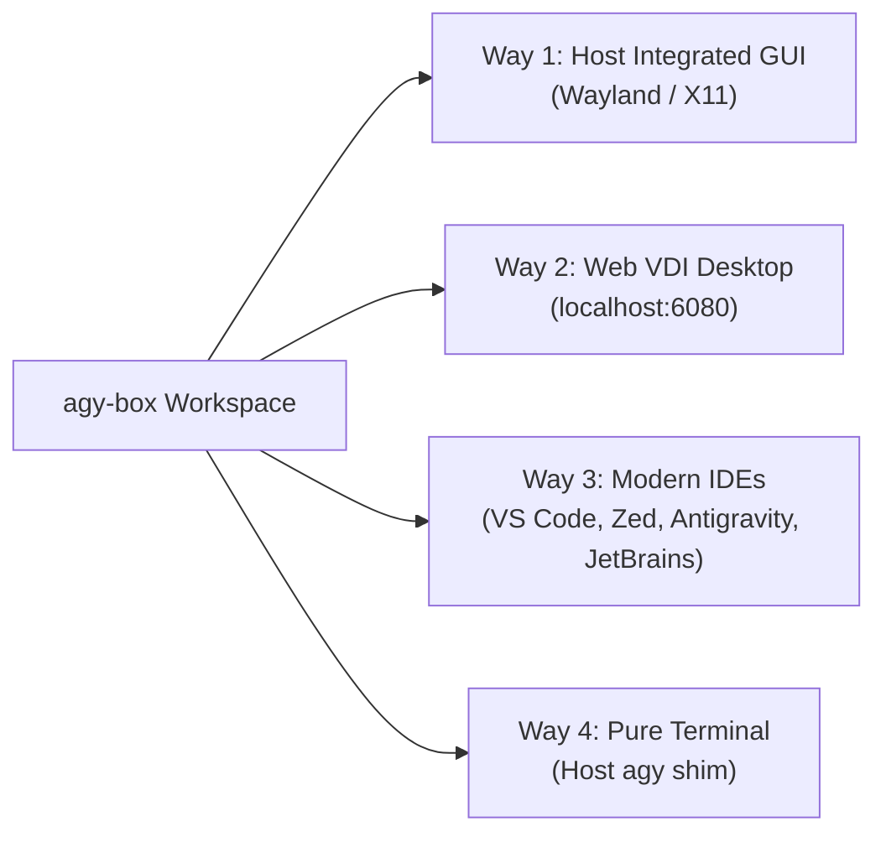

# 📘 Antigravity Dev Box (`agy-box`) — Complete User Guide

Welcome to the definitive user guide for **`agy-box`** (and companion **`agy-easy-install`**), the all-in-one AI agent development environment and sandbox for the Google Antigravity ecosystem.

Whether you are building autonomous agents with the **Antigravity SDK**, hacking with the **`agy` CLI**, building complex systems in **Visual Studio Code** or **Zed**, or testing workflows in the **Web VDI Desktop**, this guide walks you through every step.

---

## 📑 Table of Contents

1. [Quickstart (Zero-to-Hero in 60 Seconds)](#1-quickstart-zero-to-hero-in-60-seconds)
2. [The 4 Ways to Work](#2-the-4-ways-to-work)
   - [Way 1: Native Host Window Integration](#way-1-native-host-window-integration)
   - [Way 2: Browser-Based Web Desktop (noVNC VDI)](#way-2-browser-based-web-desktop-novnc-vdi)
   - [Way 3: Modern IDE Integration (VS Code, Zed, Antigravity IDE, JetBrains)](#way-3-modern-ide-integration)
   - [Way 4: Pure Terminal Workflow & Host Shim](#way-4-pure-terminal-workflow--host-shim)
3. [AI Model Authentication & Setup](#3-ai-model-authentication--setup)
   - [Personal Google Account (OAuth)](#personal-google-account-oauth)
   - [Gemini API Key](#gemini-api-key)
   - [Enterprise / Google Cloud Vertex AI (GCP ADC)](#enterprise--google-cloud-vertex-ai-gcp-adc)
   - [Local Offline Models (Open WebUI + Ollama)](#local-offline-models-open-webui--ollama)
4. [Modern IDE Deep Dive](#4-modern-ide-deep-dive)
   - [Visual Studio Code & VSCodium](#visual-studio-code--vscodium)
   - [Zed Editor](#zed-editor)
   - [Google Antigravity Classic IDE](#google-antigravity-classic-ide)
   - [JetBrains IDEs (IntelliJ IDEA, PyCharm)](#jetbrains-ides-intellij-idea-pycharm)
5. [Agentic Engineering & CLI Mastery](#5-agentic-engineering--cli-mastery)
   - [The `agy` Command Reference](#the-agy-command-reference)
   - [Slash Commands Guide (`/plan`, `/boost`, `/teamwork-preview`)](#slash-commands-guide)
   - [Concurrent Subagents](#concurrent-subagents)
   - [Autonomous Browser Automation with Chrome CDP](#autonomous-browser-automation-with-chrome-cdp)
6. [Maintenance, Checking & Updating](#6-maintenance-checking--updating)
   - [Checking Versions](#checking-versions)
   - [Updating the Agent Toolchain](#updating-the-agent-toolchain)
   - [Updating Container Packages & VS Code](#updating-container-packages--vs-code)
   - [Backing Up & Restoring Your Settings](#backing-up--restoring-your-settings)
7. [Troubleshooting & FAQ](#7-troubleshooting--faq)

---

## 1. Quickstart (Zero-to-Hero in 60 Seconds)

You do **not** need to clone any Git repositories to install and launch `agy-box`.

### Step 1: Launch the Installer
Run this single command in your host terminal:

```bash
bash -c "$(curl -fsSL https://raw.githubusercontent.com/wtg-codes/agy-box/main/agy-box-manager)"
```

The manager script will automatically:
1. Verify host prerequisites (**Podman** or **Docker**, and **Distrobox**). If missing, it offers to install them automatically using your host package manager (`dnf`, `apt`, `pacman`, `brew`, or `zypper`).
2. Pull the multi-arch image (`ghcr.io/wtg-codes/agy-box:latest`) built natively for both Intel/AMD `x86_64` and ARM64 Apple Silicon / Grace Blackwell / Raspberry Pi.
3. Create your isolated sandbox with a dedicated home directory (`~/.config/agy-box/home`), mounting your `~/.ssh`, `~/.config/gcloud`, and `~/.gitconfig` safely as **read-only**.
4. Bootstrap the Antigravity agent toolchain (`agy`, IDE, UI, SDK, ADK, Gemini CLI) and export the `agy` command directly to your host's `~/.local/bin`.

### Step 2: Install the CLI Globally
Inside the interactive menu, select:
```text
🌍 Install CLI Globally (~/.local/bin)
```
Now you can run `agy-box-manager` and `agy` anywhere on your system!

---

## 2. The 4 Ways to Work

`agy-box` adapts to however you like to build:



### Way 1: Native Host Window Integration
If you are running a desktop Linux distribution (Fedora, Ubuntu, Arch, etc.):
```bash
agy-box-manager enter
```
Inside the container terminal, launching any GUI tool (such as `antigravity`, `code`, or `google-chrome-stable`) will render directly onto your host desktop as native Wayland or X11 application windows with GPU acceleration.

### Way 2: Browser-Based Web Desktop (noVNC VDI)
If you are on a remote server, cloud VM, iPad, Chromebook, or prefer a self-contained window:
```bash
agy-box-manager desktop
```
Open **`http://localhost:6080`** in any web browser. You will see a complete, lightweight IceWM desktop environment featuring:
* Antigravity wallpaper and dark theme
* Desktop shortcuts for **VS Code**, **Zed**, **Antigravity IDE**, **Agent UI**, **Terminal**, and **Chrome**
* Taskbar with application menus and system tray

### Way 3: Modern IDE Integration
Open your project files with your favorite editor directly inside the container:
```bash
# Launch VS Code with Google.antigravity pre-installed
code .

# Launch Zed Editor (high performance Rust editor)
zed .

# Launch classic Antigravity IDE
antigravity-ide .
```

### Way 4: Pure Terminal Workflow & Host Shim
You don't even need to type `distrobox enter` to run agents. `agy-box-manager` exports a host shim to `~/.local/bin/agy`:
```bash
# Run Antigravity CLI directly from your host shell:
agy --version
agy "Analyze this repo and generate a test suite"
```
The command automatically executes inside the sandboxed container and returns the output to your host terminal.

---

## 3. AI Model Authentication & Setup

`agy-box` supports all Google AI authentication models as well as local offline LLMs.

### Personal Google Account (OAuth)
The fastest way to get started with generous free-tier model quotas:
1. Inside the container (or via Web VDI), run:
   ```bash
   agy
   ```
2. When prompted, complete the one-time browser login.
3. Your authentication tokens are saved in your container's isolated home directory (`~/.gemini/` and `~/.config/Antigravity`).

### Gemini API Key
If you use a Google AI Studio API Key:
1. Export your key in your container shell or add it to `~/.config/environment.d/agy-box.conf`:
   ```bash
   export GEMINI_API_KEY="AIzaSy..."
   ```
2. The `agy-setup-helper` wizard automatically detects this key on startup.

### Enterprise / Google Cloud Vertex AI (GCP ADC)
If your organization uses Google Cloud Platform:
1. Run Google Cloud login inside the box:
   ```bash
   gcloud auth application-default login
   ```
2. Set your Google Cloud Project:
   ```bash
   export GOOGLE_CLOUD_PROJECT="my-enterprise-project-id"
   ```

### Local Offline Models (Open WebUI + Ollama)
If you want to run models 100% locally and privately:
1. Run Ollama on your host machine:
   ```bash
   ollama run llama3
   ```
2. Open your browser to **`http://localhost:8080`**.
3. `agy-box` includes a bundled **Open WebUI** instance running in `/opt/open-webui-venv`. It communicates with host services over `localhost:11434` without sending telemetry to external clouds.

---

## 4. Modern IDE Deep Dive

### Visual Studio Code & VSCodium
* **Package Origin:** Official Microsoft repository (`packages.microsoft.com`) supporting both `amd64` and `arm64`.
* **Container Stability:** Pre-configured with container security wrappers (`--disable-dev-shm-usage --no-sandbox`).
* **Extension:** Comes pre-loaded with **`Google.antigravity`**.
* **Launch:** Click **Visual Studio Code** on the VDI Desktop or run:
  ```bash
  code .
  ```

### Zed Editor
* **Package Origin:** Official native binary from `zed-industries/zed`.
* **Extension:** Pre-configured with declarative extension management in `~/.config/zed/settings.json`:
  ```json
  {
    "auto_install_extensions": {
      "antigravity": true
    }
  }
  ```
* **Launch:** Click **Zed** on the VDI Desktop or run:
  ```bash
  zed .
  ```

### Google Antigravity Classic IDE
* **Package Origin:** Pinned official Google distribution with telemetry disabled by default.
* **Launch:** Click **Antigravity IDE** on the Desktop or run:
  ```bash
  antigravity-ide .
  ```

### JetBrains IDEs (IntelliJ IDEA, PyCharm)
To keep the base container download fast, JetBrains IDEs (~2.5 GB) are installable on-demand with one command:
```bash
# Install IntelliJ IDEA Community Edition + Antigravity plugin:
agy-install-ide intellij

# Install PyCharm Community Edition + Antigravity plugin:
agy-install-ide pycharm
```
The installer downloads the community release into `$HOME/.local/share/JetBrains/`, creates desktop shortcuts, and registers the Antigravity plugin automatically.

---

## 5. Agentic Engineering & CLI Mastery

### The `agy` Command Reference

| Command / Flag | Purpose |
| :--- | :--- |
| `agy` | Start an interactive agent chat session |
| `agy -p "prompt"` | Run a one-shot headless agent prompt and print the answer |
| `agy --resume` | Resume the most recent conversation |
| `agy --statusline` | Customize the interactive terminal status line |
| `agy --sandbox` | Run in read-only sandbox mode (no disk modifications) |

### Slash Commands Guide

When working in an interactive session (`agy`), use slash commands to activate specialized agent behaviors:

* **`/plan`**: Formulates a detailed step-by-step implementation plan before touching code. Recommended for complex refactors.
* **`/boost`**: Activates deep multi-perspective reasoning for difficult bugs or architecture design.
* **`/teamwork-preview`**: Orchestrates a team of autonomous subagents working on parallel tasks.
* **`/learn`**: Teaches the agent a permanent preference or pattern to store in your project rules.
* **`/goal`**: Directs the agent to work persistently until a long-running objective is fully satisfied.

### Concurrent Subagents
The Antigravity engine can spawn autonomous background workers:
```text
> Please launch two subagents: one to audit security rules and one to write unit tests.
```
Subagents run in background branches, update their task logs, and alert you upon completion.

### Autonomous Browser Automation with Chrome CDP
`agy-box` ships with **Google Chrome** (`google-chrome-stable` on amd64, Chromium on arm64). AI agents can connect over the Chrome DevTools Protocol (port `9222`) to:
* Navigate web applications
* Inspect DOM and accessibility trees
* Capture screenshots and inspect network payloads
* Verify web frontend layouts autonomously

---

## 6. Maintenance, Checking & Updating

### First-Run Setup Wizard (`wizard`)
To configure or reconfigure your container runtime, keyring isolation mode, default IDE, and host profile seeding interactively:
```bash
agy-box-manager wizard
```
To initialize standard, rock-solid defaults non-interactively (e.g. in CI or unattended environments):
```bash
agy-box-manager wizard --defaults
```
All settings are persisted in `~/.config/agy-box/config.env`.

### Checking System & Component Versions (`check`)
To inspect your entire environment in a unified, beautifully formatted diagnostic dashboard:
```bash
agy-box-manager check
```
This inspects:
* **Host OS & Kernel Architecture**: Distro version, CPU architecture (`x86_64` or `aarch64`).
* **Container Engine & Distrobox**: Active runtime (Podman vs Docker, rootless vs rootful status) and Distrobox version.
* **Workspace Containers**: Registration and run states for both `agy-box` (Official) and `agy-box-dev` (Dev).
* **Antigravity Toolchain**: `agy` CLI version, Python, Node.js, Google Cloud SDK (`gcloud`), and GitHub CLI (`gh`).
* **IDE Integrations**: Visual Studio Code, Zed Editor, and JetBrains with their Antigravity extension states.
* **Keyring & Authentication**: Active keyring backend (Host SecretService vs Air-gapped EncryptedKeyring), Google Cloud auth, GitHub login, and Antigravity tokens.

### Keyring Modes: Host vs. Isolated
`agy-box` supports two distinct credential storage profiles:
* **Host Mode (`AGY_KEYRING_MODE="host"`)**:
  Shares your host desktop's D-Bus Secret Service (GNOME Keyring / KWallet). Logins and tokens stored on your host machine are seamlessly accessible inside the container without re-authenticating.
* **Isolated Mode (`AGY_KEYRING_MODE="isolated"`)**:
  Completely unmaps the host D-Bus session bus (`--unsetenv=DBUS_SESSION_BUS_ADDRESS`) and configures a container-local `EncryptedKeyring` (`keyrings.alt.file.EncryptedKeyring`). All agent credentials, API tokens, and secrets remain securely quarantined inside `~/.config/agy-box/home/`.

### Updating the Environment (`update`)
Keep your agent toolchain, IDE extensions, and container OS packages up to date with a single command:
```bash
# Update everything (Toolchain, IDE extensions, Container packages)
agy-box-manager update

# Dry-run inspection (checks what would be updated)
agy-box-manager update --check

# Target specific components
agy-box-manager update --toolchain    # Updates agy CLI, IDE, UI, SDK, ADK, Gemini CLI
agy-box-manager update --ides         # Refreshes VS Code and Zed Antigravity extensions
agy-box-manager update --packages     # Upgrades Chrome, VS Code, and apt packages in box

# Update the dev workspace container instead of official
agy-box-manager update dev --all
```

### Backing Up & Restoring Your Settings (`backup` & `restore`)
Back up all your agent configurations, conversation transcripts, subagent brains, custom skills, rules, and IDE settings into a single compressed archive:

```bash
# Create an automatic timestamped backup (e.g. agy-box-backup-20261010-223000.tar.gz)
agy-box-manager backup

# Or specify a custom output path
agy-box-manager backup /path/to/my-backup.tar.gz
```

To restore your state on the same or a new machine:
```bash
# Restore interactively (with confirmation prompt)
agy-box-manager restore /path/to/my-backup.tar.gz

# Restore unattended / non-interactively
agy-box-manager restore /path/to/my-backup.tar.gz -y
```
The manager automatically validates archive integrity, restores your files into `~/.config/agy-box/`, and re-synchronizes rootless container permissions.

---

## 7. Troubleshooting & FAQ

### Q: "Permission Denied" when creating files on the host
* **Cause:** Docker daemon running as root without user namespace remapping.
* **Fix:** Install **Podman** (`sudo dnf install podman` or `sudo apt install podman`), which maps user namespaces seamlessly. `agy-box-manager` will automatically prioritize it.

### Q: GUI applications do not appear on host desktop
* **Cause:** Host Wayland or X11 compositor is restricting outside connections.
* **Fix:** Run `xhost +local:` on your host terminal, then launch the app again. Alternatively, run `agy-box-manager desktop` to view apps in your browser via noVNC.

### Q: I need to force Docker instead of Podman
* **Fix:** Export the container manager before running the script:
  ```bash
  export DBX_CONTAINER_MANAGER="docker"
  agy-box-manager install
  ```

### Q: How do I completely reset the box?
```bash
agy-box-manager clean
agy-box-manager install
```
Your code workspaces in `~/` and your isolated home files in `~/.config/agy-box/home` remain preserved!
