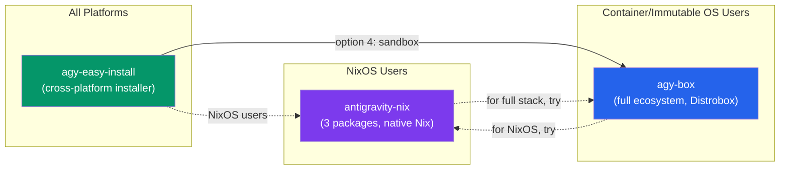

# 🔍 antigravity-nix vs agy-box — Comparative Analysis

> [!NOTE]
> **PLAN ONLY** — This is a research artifact, not a code change proposal.

---

## What is antigravity-nix?

A community-maintained **Nix flake** (by [sqrrrl](https://github.com/sqrrrl) / Steve Bazyl) that packages Google Antigravity for NixOS and systems using the Nix package manager. It solves a NixOS-specific problem: proprietary Electron apps like Antigravity expect standard FHS paths (`/usr/lib`, `/lib64`) that NixOS doesn't have.

**Packages 3 components:**
1. `google-antigravity` — Agent UI
2. `google-antigravity-ide` — VS Code-based IDE  
3. `google-antigravity-cli` / `agy` — CLI tool

**Does NOT package:** Python SDK, Google ADK, Gemini CLI, Chrome, CNCF tools, VDI desktop, or any ecosystem tooling.

---

## Side-by-Side Comparison

| Dimension | antigravity-nix | agy-box | agy-easy-install (new name) |
|-----------|----------------|---------|----------------------------|
| **Paradigm** | Nix flake (declarative functional) | Distrobox + OCI container | Cross-platform `curl \| bash` installer |
| **Base** | NixOS / Nix on any Linux | Ubuntu 22.04 LTS toolbox image | Host OS native |
| **Components** | 3 (Agent UI, IDE, CLI) | **7+** (Agent UI, IDE, CLI, SDK, ADK, Gemini CLI, Chrome, CNCF tools, VDI) | 4+ (IDE, CLI, SDK + agy-box option) |
| **Hash verification** | ✅ Nix SRI hashes | ✅ SHA-256/512 in install scripts | ✅ SHA-256/512 in `versions.json` |
| **Version pinning** | `flake.lock` — user-controlled | Hardcoded URLs + hashes | `versions.json` historical catalog |
| **Update mechanism** | Daily CI auto-detects new releases | Manual rebuild + CI on push | Nightly CI scrape + `--update` flag |
| **Platform support** | Linux (CI-tested), macOS (experimental) | Linux (designed for immutable distros) | **Linux, macOS, WSL2, ChromeOS** |
| **Host integration** | Delegates to NixOS/Home Manager | Deep: D-Bus, Keyring, Wayland/X11, audio | Direct host install or delegates to agy-box |
| **Reproducibility** | Extremely high (Nix guarantees) | High (OCI + SBOM + attestations) | Medium (depends on host state) |
| **Supply chain security** | CI hash verification | ✅ SLSA attestations + SPDX SBOM | SHA verification |

---

## ✅ Patterns WORTH Borrowing

### 1. Automated Upstream Version Tracking ⭐ (Highest Value)

antigravity-nix runs a **daily CI job** that:
- Scrapes for new Antigravity binary releases
- Verifies hashes against downloaded artifacts
- Auto-commits updated version info to the flake

**How to apply to agy-box:**
- agy-box currently hardcodes URLs and hashes in `scripts/install-*.sh` and the `Containerfile`
- A similar nightly CI job could detect new releases and auto-generate PRs with updated URLs + hashes
- `agv-easy-install` already has a nightly scraper — **share this infrastructure with agy-box**

> [!TIP]
> This is the single most valuable pattern to adopt. It reduces manual maintenance and catches upstream updates faster.

### 2. Modular Component Separation

Each Antigravity component is independently installable in antigravity-nix.

**How to apply to agy-box:**
- Consider `ARG` flags in the Containerfile to make components optional:
  ```dockerfile
  ARG INSTALL_IDE=true
  ARG INSTALL_SDK=true
  ARG INSTALL_ADK=true
  ```
- Allows lighter custom images for CI or headless environments

### 3. User-Controlled Update Cadence

Nix users explicitly decide when to update via `nix flake update`.

**How to apply to agy-box:**
- Consider a version pinning mechanism so users can opt into specific container image tags rather than always pulling `latest`
- Already partially supported via GHCR image tags, but could be more explicit

### 4. Cross-Project Hash Database

Both projects independently verify binary hashes. Consider:
- A shared, community-maintained hash database
- Or at minimum, cross-referencing each other's hashes for supply chain security

---

## ❌ Things that CONFLICT / Would BREAK agy-box

| Pattern | Why it conflicts |
|---------|-----------------|
| **NixOS-centric design** | agy-box targets Ubuntu containers. Adding Nix inside the container adds massive complexity for zero benefit. |
| **FHS environment wrappers** | Solves a NixOS-specific problem. Ubuntu already has standard FHS. Pure overhead in agy-box. |
| **Narrow scope (3 packages only)** | antigravity-nix's minimalism is intentional for Nix users. agy-box's batteries-included approach is its key differentiator. |
| **No host integration logic** | antigravity-nix delegates display/keyring/IPC to NixOS. agy-box handles this bridging as a core feature. |
| **Nix flake lockfile** | Requires all users to have Nix. Completely counter to agy-box's "just need Podman + Distrobox" philosophy. |
| **Declarative config model** | agy-box users expect imperative scripts, env files, interactive setup. Nix expressions would alienate the target audience. |

---

## 🤝 Cross-Pollination Opportunities



1. **agy-box README**: Point NixOS users to antigravity-nix as the recommended alternative for their platform
2. **antigravity-nix docs**: Point users wanting full ecosystem (SDK, ADK, VDI) to agy-box
3. **Share version tracking**: agv-easy-install's nightly scraper could feed updates to agy-box
4. **Coordinate hashes**: Cross-reference verified hashes for supply chain trust

---

## Verdict

> **antigravity-nix is complementary, not competitive.** It serves a different audience (NixOS) with a different philosophy (minimal, declarative). The only high-value pattern to adopt is **automated upstream version tracking**. Everything else is NixOS-specific and should not be ported to agy-box.
