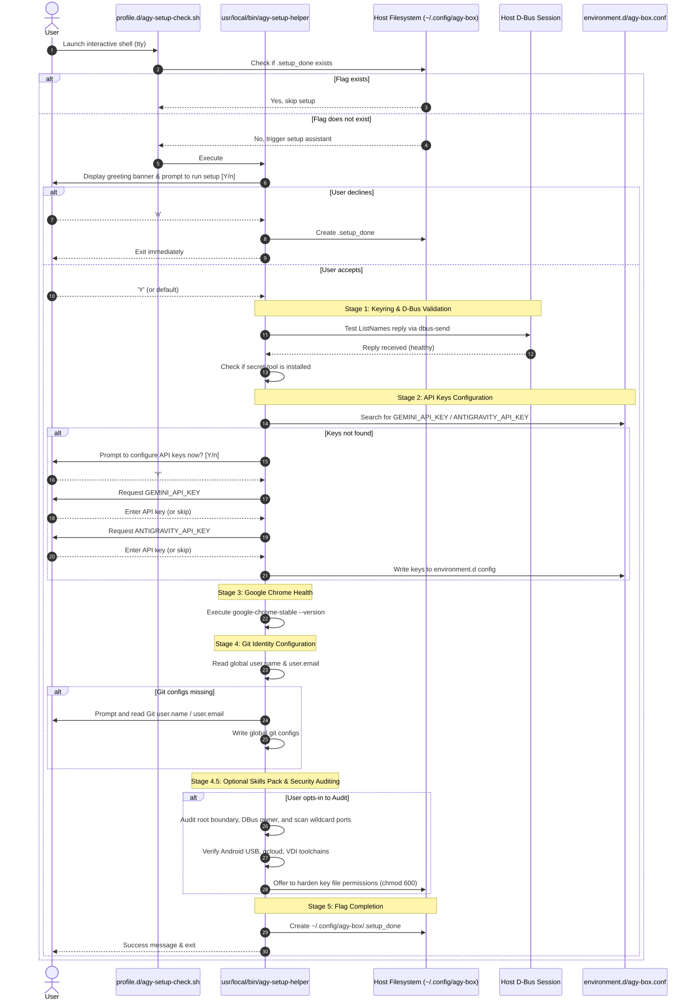

# agy-box System Architecture & Design Guide

This document provides a deep dive into the inner workings of the `agy-box` developer sandbox, detailing how it achieves seamless host integration, manages graphical rendering, secures credentials, and facilitates first-time configuration.

---

## 1. System Topology & Bridging

Unlike typical sandbox runtimes that completely isolate applications, `agy-box` uses **Distrobox** (on top of Podman or Docker) to act as a **host-integrated developer environment**.

*Source: [system-topology.mmd](diagrams/src/system-topology.mmd)*

---

## 2. Interactive Setup Assistant Sequence Flow

When a user opens an interactive shell session in the `agy-box` container for the first time, a hook in `/etc/profile.d/agy-setup-check.sh` is triggered. The helper handles verifying the environment and setting up credentials.

*Source: [setup-flow.mmd](diagrams/src/setup-flow.mmd)*

---

## 3. D-Bus session keyring pipelines

Google Chrome and Google Antigravity (Agent UI) encrypt credentials (e.g. Google sign-in tokens, saved passwords) using the host OS keyring manager (GNOME Keyring or KWallet). 

Even though the D-Bus socket is forwarded into the sandbox container by Distrobox, client applications must have the `libsecret` library installed inside the container to make method calls over D-Bus to request credentials decryption. Without `libsecret-1-0`, these apps fail to authenticate silently.

*Source: [keyring-pipeline.mmd](diagrams/src/keyring-pipeline.mmd)*

---

## 4. Port Mappings & IPC Loops

The components of the Antigravity developer suite communicate over a series of ports and sockets inside the container loop:

| Port | Protocol | Source | Target | Description |
| :--- | :--- | :--- | :--- | :--- |
| **8080** | HTTP | Python SDK (`google-antigravity`) | Google Antigravity (Agent UI) | Localhost developer API server mapping workspace canvases. |
| **9222** | WebSocket / CDP | Google Antigravity (Agent UI) | `google-chrome-stable` | Chrome DevTools Protocol port to dynamically execute web commands. |
| **5900** | RFB | VNC Clients | `x11vnc` | Internal virtual display VNC server stream (bound securely to `127.0.0.1`). |
| **6080** | HTTP / WS | Web Browsers | `websockify` / noVNC | noVNC HTML5 client portal enabling remote/VDI browser desktop access. |
| **dynamic** | WebSocket | Antigravity CLI (`agy`) | Google Antigravity (Agent UI) | Active loop coordinating lab course task completion updates. |

---

## 5. VDI Web Desktop (Headless Display Routing)

To support remote development, headless environments (e.g. Google Cloud Shell, VMs), and easy environment debugging, the workspace provides a built-in virtual desktop environment utilizing **noVNC** and **Xvfb**.

*Source: [vdi-routing.mmd](diagrams/src/vdi-routing.mmd)*

