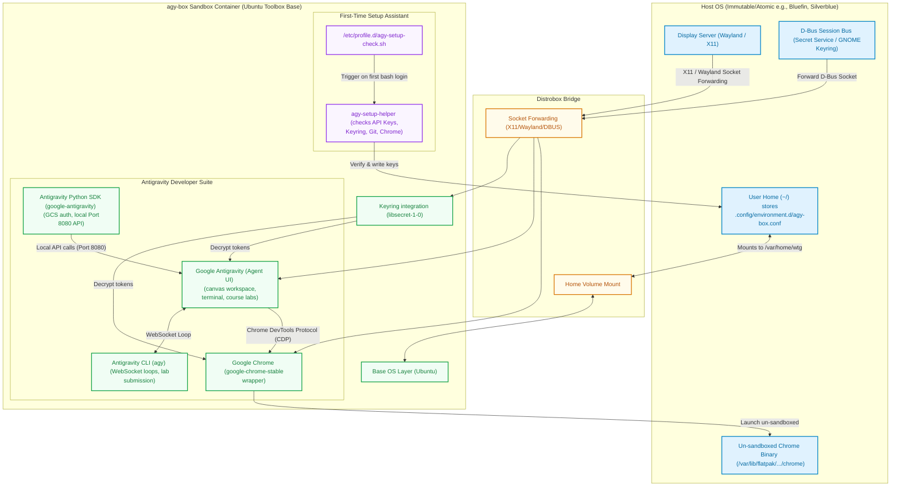
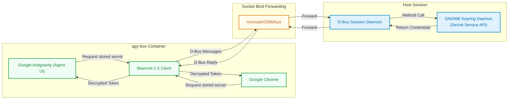
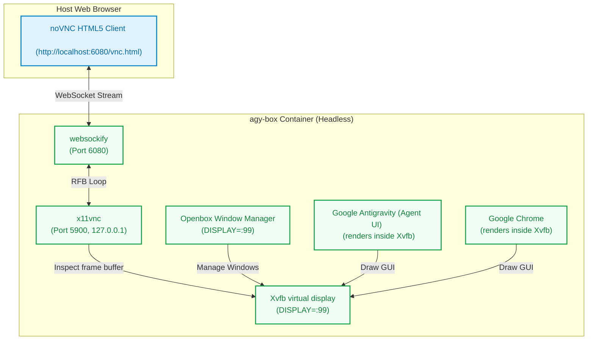

# agy-box System Architecture & Design Guide

This document provides a deep dive into the inner workings of the `agy-box` developer sandbox, detailing how it achieves seamless host integration, manages graphical rendering, secures credentials, and facilitates first-time configuration.

---

## 1. System Topology & Bridging

Unlike typical sandbox runtimes that completely isolate applications, `agy-box` uses **Distrobox** (on top of Podman or Docker) to act as a **host-integrated developer environment**.



---

## 2. Interactive Setup Assistant Sequence Flow

When a user opens an interactive shell session in the `agy-box` container for the first time, a hook in `/etc/profile.d/agy-setup-check.sh` is triggered. The helper handles verifying the environment and setting up credentials.

```mermaid
sequenceDiagram
    autonumber
    actor User
    participant Hook as profile.d/agy-setup-check.sh
    participant Helper as usr/local/bin/agy-setup-helper
    participant HostFS as Host Filesystem (~/.config/agy-box)
    participant DBus as Host D-Bus Session
    participant Config as environment.d/agy-box.conf

    User->>Hook: Launch interactive shell (tty)
    Hook->>HostFS: Check if .setup_done exists
    alt Flag exists
        HostFS-->>Hook: Yes, skip setup
    else Flag does not exist
        HostFS-->>Hook: No, trigger setup assistant
        Hook->>Helper: Execute
        Helper->>User: Display greeting banner & prompt to run setup [Y/n]
        alt User declines
            User-->>Helper: 'n'
            Helper->>HostFS: Create .setup_done
            Helper-->>User: Exit immediately
        else User accepts
            User-->>Helper: 'Y' (or default)
            
            Note over Helper,DBus: Stage 1: Keyring & D-Bus Validation
            Helper->>DBus: Test ListNames reply via dbus-send
            DBus-->>Helper: Reply received (healthy)
            Helper->>Helper: Check if secret-tool is installed
            
            Note over Helper,Config: Stage 2: API Keys Configuration
            Helper->>Config: Search for GEMINI_API_KEY / ANTIGRAVITY_API_KEY
            alt Keys not found
                Helper->>User: Prompt to configure API keys now? [Y/n]
                User-->>Helper: 'Y'
                Helper->>User: Request GEMINI_API_KEY
                User-->>Helper: Enter API key (or skip)
                Helper->>User: Request ANTIGRAVITY_API_KEY
                User-->>Helper: Enter API key (or skip)
                Helper->>Config: Write keys to environment.d config
            end
            
            Note over Helper: Stage 3: Google Chrome Health
            Helper->>Helper: Execute google-chrome-stable --version
            
            Note over Helper: Stage 4: Git Identity Configuration
            Helper->>Helper: Read global user.name & user.email
            alt Git configs missing
                Helper->>User: Prompt and read Git user.name / user.email
                Helper->>Helper: Write global git configs
            end

            Note over Helper: Stage 4.5: Optional Skills Pack & Security Auditing
            alt User opts-in to Audit
                Helper->>Helper: Audit root boundary, DBus owner, and scan wildcard ports
                Helper->>Helper: Verify Android USB, gcloud, VDI toolchains
                Helper->>HostFS: Offer to harden key file permissions (chmod 600)
            end

            Note over Helper,HostFS: Stage 5: Flag Completion
            Helper->>HostFS: Create ~/.config/agy-box/.setup_done
            Helper-->>User: Success message & exit
        end
    end

    %% Diagram Styling
    style Hook fill:#faf5ff,stroke:#9333ea,stroke-width:1px
    style Helper fill:#faf5ff,stroke:#9333ea,stroke-width:1px
    style HostFS fill:#fffbeb,stroke:#d97706,stroke-width:1px
    style DBus fill:#e0f2fe,stroke:#0284c7,stroke-width:1px
    style Config fill:#fffbeb,stroke:#d97706,stroke-width:1px
```

---

## 3. D-Bus session keyring pipelines

Google Chrome and Google Antigravity (Agent UI) encrypt credentials (e.g. Google sign-in tokens, saved passwords) using the host OS keyring manager (GNOME Keyring or KWallet). 

Even though the D-Bus socket is forwarded into the sandbox container by Distrobox, client applications must have the `libsecret` library installed inside the container to make method calls over D-Bus to request credentials decryption. Without `libsecret-1-0`, these apps fail to authenticate silently.



---

## 4. Port Mappings & IPC Loops

The components of the Antigravity developer suite communicate over a series of ports and sockets inside the container loop:

| Port | Protocol | Source | Target | Description |
| :--- | :--- | :--- | :--- | :--- |
| **8080** | HTTP | Python SDK (`google-antigravity`) | Google Antigravity (Agent UI) | Localhost developer API server mapping workspace canvases. |
| **9222** | WebSocket / CDP | Google Antigravity (Agent UI) | `google-chrome-stable` | Chrome DevTools Protocol port to dynamically execute web commands. |
| **5900** | RFB | VNC Clients | `x11vnc` | Internal virtual display VNC server stream (bound securely to `127.0.0.1`). |
| **6080** | HTTP / WS | Web Browsers | `websockify` / noVNC | noVNC HTML5 client portal enabling remote/VDI browser desktop access. |
| **dynamic** | WebSocket | Antigravity CLI (`agy`) | Google Antigravity (Agent UI) | Active loop coordinating lab course task completion updates. |

---

## 5. VDI Web Desktop (Headless Display Routing)

To support remote development, headless environments (e.g. Google Cloud Shell, VMs), and easy environment debugging, the workspace provides a built-in virtual desktop environment utilizing **noVNC** and **Xvfb**.



