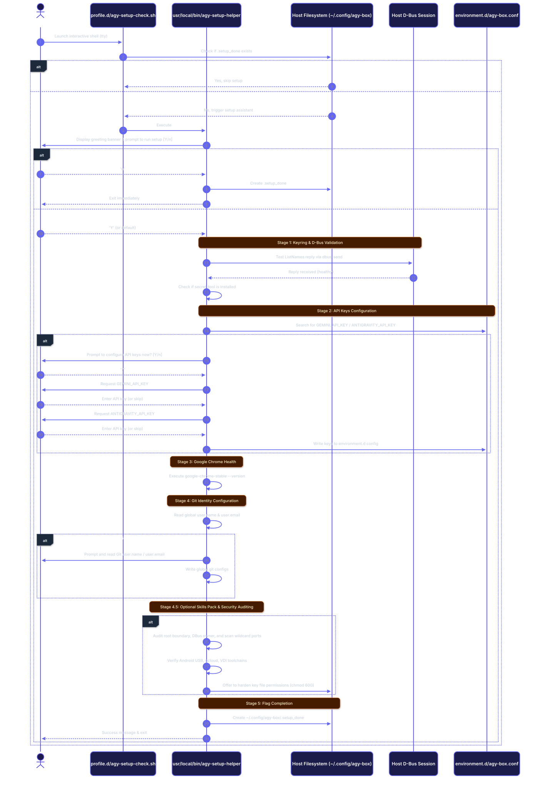
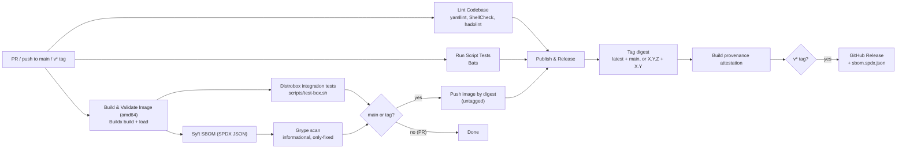

# agy-box System Architecture & Design Guide

This document provides a deep dive into the inner workings of the `agy-box` developer sandbox, detailing how it achieves seamless host integration, manages graphical rendering, secures credentials, and facilitates first-time configuration.

---

## 1. System Topology & Bridging

Unlike typical sandbox runtimes that completely isolate applications, `agy-box` uses **Distrobox** (on top of Podman or Docker) to act as a **host-integrated developer environment**.

---

## 2. Interactive Setup Assistant Sequence Flow

When a user opens an interactive shell session in the `agy-box` container for the first time, a hook in `/etc/profile.d/agy-setup-check.sh` is triggered. The helper handles verifying the environment and setting up credentials.

---

## 3. D-Bus session keyring pipelines

Google Chrome and Google Antigravity (Agent UI) encrypt credentials (e.g. Google sign-in tokens, saved passwords) using the host OS keyring manager (GNOME Keyring or KWallet). 

Even though the D-Bus socket is forwarded into the sandbox container by Distrobox, client applications must have the `libsecret` library installed inside the container to make method calls over D-Bus to request credentials decryption. Without `libsecret-1-0`, these apps fail to authenticate silently.

---

## 4. Port Mappings & IPC Loops

The components of the Antigravity developer suite communicate over a series of ports and sockets inside the container loop:

| Port | Protocol | Source | Target | Description |
| :--- | :--- | :--- | :--- | :--- |
| **8080** | HTTP | Python SDK (`google-antigravity`) | Google Antigravity (Agent UI) | Localhost developer API server mapping workspace canvases. |
| **8080** | HTTP | Web Browsers | Open WebUI (`just agy-local-ui`) | Local Workspace Web Dashboard. Shares the port number with the Agent UI API, so do not run both at the same time. |
| **8081** | HTTP | Web Browsers | Open WebUI (`just agy-local-ui-dev`) | Isolated dev/test instance of the Local Workspace Web Dashboard. |
| **11434** | HTTP | Open WebUI | Ollama (host/container) | Local model backend expected by `just agy-local-ui` (not shipped in the image). |
| **9222** | WebSocket / CDP | Google Antigravity (Agent UI) | `google-chrome-stable` | Chrome DevTools Protocol port to dynamically execute web commands. |
| **5900** | RFB | VNC Clients | `x11vnc` | Internal virtual display VNC server stream (bound securely to `127.0.0.1`). |
| **6080** | HTTP / WS | Web Browsers | `websockify` / noVNC | noVNC HTML5 client portal enabling remote/VDI browser desktop access (listens on `0.0.0.0`, no password). |
| **dynamic** | WebSocket | Antigravity CLI (`agy`) | Google Antigravity (Agent UI) | Active loop coordinating lab course task completion updates. |

---

## 5. VDI Web Desktop (Headless Display Routing)

To support remote development, headless environments (e.g. Google Cloud Shell, VMs), and easy environment debugging, the workspace provides a built-in virtual desktop environment utilizing **noVNC** and **Xvfb**, started on demand by `agy-vdi` (`agy-box-manager desktop`). See [ADR-0003](architecture/adr/0003-headless-novnc-display-routing.md) for the design.

## 6. Cloud & Alternative Deployment Architectures

Because `agy-box` is built as a self-contained, standard OCI image (`ghcr.io/wtg-codes/agy-box`, `linux/amd64`), it can execute without the host-integration layers (such as host home folder bind-mounts or local Wayland compositor sockets) required for distrobox.

When run outside Distrobox, the image entrypoint (`/usr/local/bin/entrypoint.sh`, run under `tini`) only creates an unprivileged `agyuser` (UID/GID from `PUID`/`PGID`, default `9000`), fixes ownership of the `/workspace` and `/config` volumes, and executes the container command (default `sleep infinity`) as that user. No desktop, VNC, or SSH service is started automatically.

### A. Standalone Headless Deployment (Cloud VMs)
When running on standard Cloud VMs (Compute Engine, EC2):
1. **Graphics Routing:** The local X11/Wayland display server is bypassed. Running `agy-vdi` inside the container (e.g. `docker exec -it <name> agy-vdi`) starts **Xvfb** at display `:99`.
2. **Display Streaming:** **x11vnc** hooks into the virtual framebuffer and streams the **IceWM** desktop (with PCManFM desktop icons) via the RFB protocol on `127.0.0.1:5900`.
3. **Web Proxying:** **websockify** translates the RFB stream into a WebSocket connection and hosts the **noVNC** HTML5 client on port `6080`, allowing remote developers to interact with the GUI directly via web browser. There is no authentication, so publish the port only behind a firewall or SSH tunnel.

### B. Devcontainer Integration (GitHub Codespaces / Coder)
When used as a devcontainer:
1. **Workspace Mounting:** The cloud provider mounts the active repository workspace folder into the container (this repository's [`.devcontainer/devcontainer.json`](../.devcontainer/devcontainer.json) mounts it at `/workspace`).
2. **Port Forwarding:** The provider forwards the standard communication ports (e.g., `6080` for noVNC, `8080` for the Antigravity API, and `9222` for the Chrome DevTools Protocol), exposing them securely over HTTPS via OAuth proxy loops.
3. **Toolchain:** The image provides the system-level toolchain (Chrome, CNCF tools, VDI stack, Open WebUI); the per-user Antigravity toolchain is installed into `~/.local` with `agy-install-toolchain`.

### C. Jules VM Execution Parity
When executed by the autonomous agent orchestration runtime (Jules):
1. The orchestrator spins up the image inside a sandboxed VM.
2. It bypasses GUI/Desktop services entirely, running task executors and bash verification gates directly inside the container.
3. Using the exact same image ensures that any test assertions executed in CI or on the agent's VM are consistent with the developer's local environment.

---

## 7. Image Composition

The image is intentionally split into a system layer (baked at build time) and a per-user layer (installed into the box user's home):

| Layer | Installed by | Contents |
| :--- | :--- | :--- |
| Base | `ghcr.io/ublue-os/ubuntu-toolbox` (pinned digest) | Ubuntu 26.04 LTS toolbox userland (`linux/amd64` only). |
| System deps | `scripts/install-agent-deps.sh` | git, curl, jq, Python/pipx, Node.js/npm, `libsecret-1-0` + Python keyring, `tini`, `gosu`, Gum, Google Chrome (wrapped), Xvfb, x11vnc, IceWM, PCManFM, noVNC, websockify, xterm. |
| Local Web Dashboard | `scripts/install-open-webui.sh` | Python 3.12 + `uv`, Open WebUI in `/opt/open-webui-venv` with CPU-only PyTorch. |
| CNCF tools | `scripts/install-tools.sh` | `kubectl`, `helm`, `k9s` (pinned versions, checksum-verified). |
| rootfs overlay | `rootfs/` | `agy-setup-helper`, `agy-vdi`, `entrypoint.sh`, profile hook, IceWM config, desktop icons, versioned wallpaper. |
| Per-user toolchain | `agy-install-toolchain` (run by `agy-box-manager install`) | Antigravity Agent UI, Antigravity IDE, Antigravity CLI (`agy`), Antigravity SDK, Google ADK, Gemini CLI in `~/.local`. |

---

## 8. CI/CD Pipeline

The [`CI/CD` workflow](../.github/workflows/ci.yml) builds and validates a single `linux/amd64` image. Pull requests run every check but never push; pushes to `main` and `v*` tags additionally publish.

```mermaid
flowchart LR
    trigger["PR / push to main / v* tag"] --> lint["Lint Codebase<br/>yamllint, ShellCheck, hadolint"]
    trigger --> bats["Run Script Tests<br/>Bats"]
    trigger --> build["Build & Validate Image (amd64)<br/>Buildx build + load"]
    build --> itest["Distrobox integration tests<br/>scripts/test-box.sh"]
    build --> sbom["Syft SBOM (SPDX JSON)"]
    sbom --> grype["Grype scan<br/>informational, only-fixed"]
    itest --> push{"main or tag?"}
    grype --> push
    push -- "yes" --> digest["Push image by digest<br/>(untagged)"]
    push -- "no (PR)" --> done["Done"]
    lint --> publish["Publish & Release"]
    bats --> publish
    digest --> publish
    publish --> tags["Tag digest<br/>latest + main, or X.Y.Z + X.Y"]
    tags --> prov["Build provenance attestation"]
    prov --> release{"v* tag?"}
    release -- "yes" --> gh["GitHub Release<br/>+ sbom.spdx.json"]
```

Notes:
- Only `linux/amd64` is built because the upstream base image is amd64-only; previously published "arm64" images were actually amd64 userland built under QEMU.
- The SBOM is published as a workflow artifact and a release asset, not as a registry attestation (the SBOM of the multi-GB image exceeds the attestation size limit).
- [`pages.yml`](../.github/workflows/pages.yml) deploys `docs/` to [GitHub Pages](https://wtg-codes.github.io/agy-box/) on every push to `main`; [`compile-diagrams.yml`](../.github/workflows/compile-diagrams.yml) re-renders `docs/diagrams/*.mmd` to `docs/diagrams/rendered/` when the sources change.

---

## 9. Architectural Decision Records (ADRs)

The following architectural decision records document the technical reasoning and trade-offs for core system designs:

- [ADR-0001: Distrobox Sandbox Base](architecture/adr/0001-distrobox-sandbox-base.md)
- [ADR-0002: Credentials Decryption via D-Bus Session Keyring Forwarding and libsecret](architecture/adr/0002-dbus-keyring-decryption.md)
- [ADR-0003: Virtual Desktop Display Routing](architecture/adr/0003-headless-novnc-display-routing.md)
- [ADR-0004: Interactive Setup Assistant Hook](architecture/adr/0004-setup-assistant-profile-hook.md)
